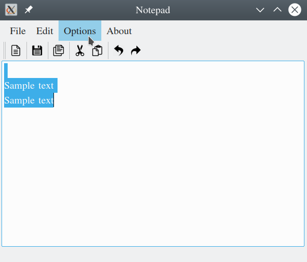
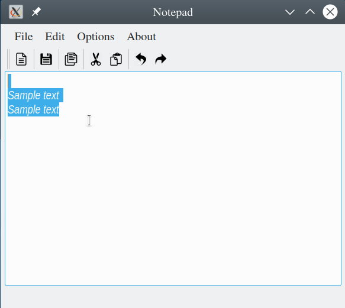

# CuteNotePad
## A basic Notepad desktop application made using Qt.

### Working :

#### Main Window:

#### Sample text:

#### "File":

#### "Edit":

#### "Options" :

#### Copy - Paste :

#### Cut - Paste :

#### Undo :

#### Redo :

#### Chaning Font :

#### Saving :

