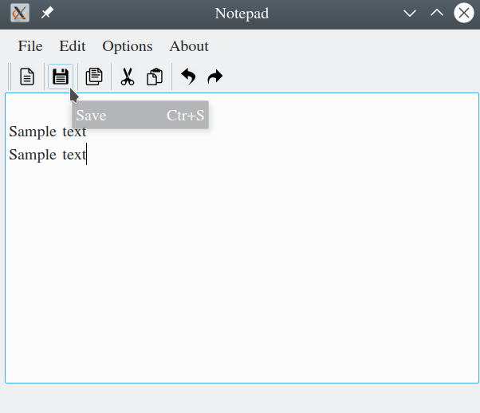

# CuteNotePad
A basic Notepad desktop application made using Qt.

## Getting Started 
To run CuteNotePad on your system, you will need to install Qt5.

### Prequisites 
- Qt5

### Installing
Follow the instructions given in the [official documentation for Qt installation](http://doc.qt.io/qt-5/gettingstarted.html)

After setting up Qt, clone this repository in a local directory on your machine

````
git clone "https://github.com/akhilam512/CuteNotePad.git"
````
Open QtCreator and Go to Open Projects and select the "Notepad.pro" in the cloned repository directory. 

"Build and Run" the project.


## Working :

#### Main Window:


#### Sample text:


#### Copy - Paste :


#### Cut - Paste :


#### Undo :


#### Redo :


#### Chaning Font :


#### Saving :




